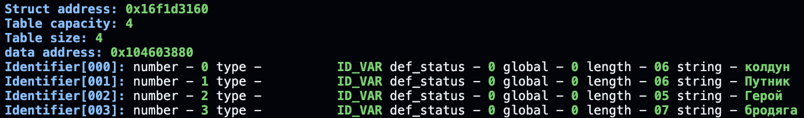
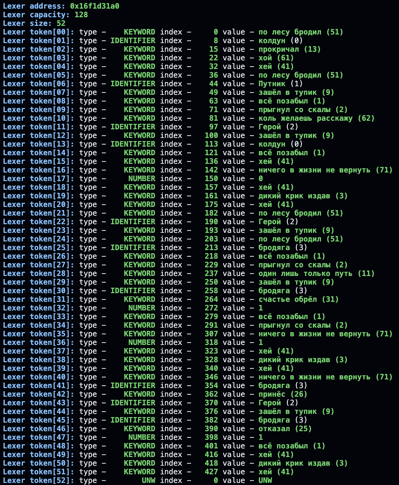
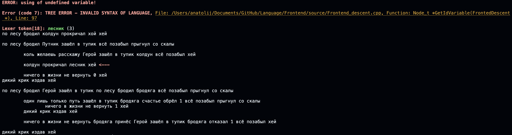
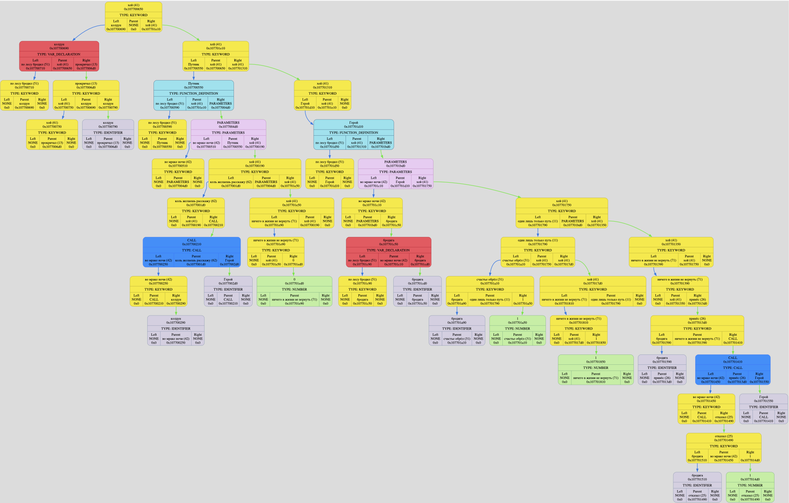
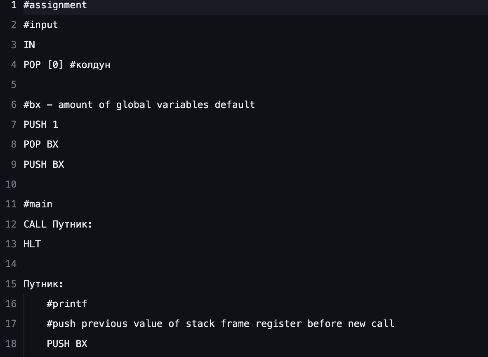
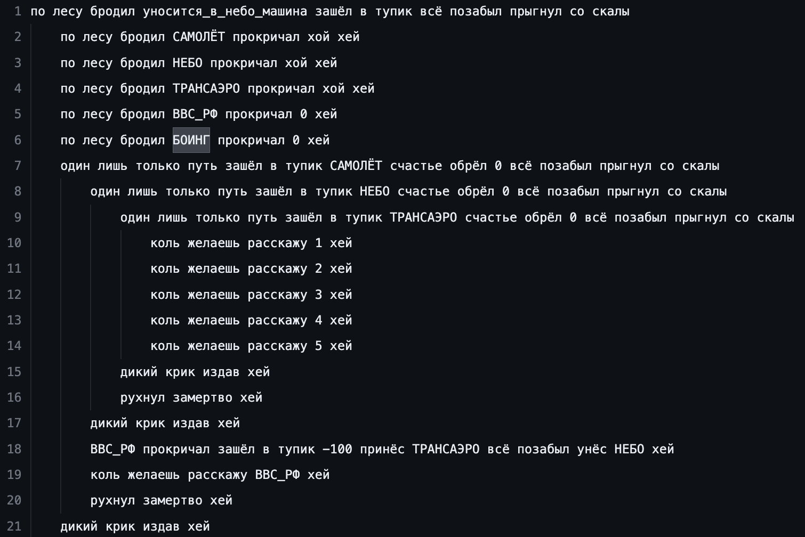

# Language

## Оглавление

- [Общая информация](#общая-информация)
- [Начало работы](#начало-работы)
- [Ключевые слова](#ключевые-слова)
- [Лексический анализ](#лексический-анализ)
- [Frontend](#frontend)
- [Стандарт дерева](#стандарт-дерева)
- [Middleware](#middleware)
- [Backend](#backend)
- [Обратный Frontend](#обратный-frontend)
- [Благодарности](#благодарности)

## Общая информация

Проект представляет собой спецификацию и реализацию стандарта моего собственного языка программирования.

## Начало работы

### Установка

Чтобы воспользоваться возможностями данного проекта, необходимо скопировать репозиторий, прописав следующую строку в терминале:

```
git clone https://github.com/TolikRogov/Language
```

### Запуск

В файле [`main.txt`](data/main.txt) записывается основной текст программы. Допустимый синтаксис языка будет описан далее. Для работы программы необходимо запустить _файл-старта_, находясь в корневом каталоге проекта:

```
./run
```

> [!NOTE]
> Программа последовательно запустит основные этапы проекта, после чего будет предложено выбрать файл, который нужно будет исполнить [процессору](https://github.com/TolikRogov/Processor).

Для запуска отдельных частей необходимо перейти в один из следующих каталогов: [`Frontend`](Frontend), [`Middleware`](Middleware), [`Backend`](Backend), [`ReverseFrontend`](ReverseFrontend) - прописав аналогичную команду.

## Ключевые слова

Ключевые слова представляют собой набор из определенного количества зарезервированных слов, каждое из которых обладает уникальным номером (как и всё ключевое слово целиком), а также имеет последовательность строковых символов (в моём случае, символов кириллицы), непосредственно составляющих данное ключевое слово.

В таблице перечислены все ключевые слова, использующиеся в моём языке, с их значениями на языке C:

| Номер |        Ключевое слово        | Значение |
| :---: | :--------------------------: | :------: |
|   1   |         всё позабыл          |    )     |
|   2   |       прыгнул со скалы       |    {     |
|   3   |       дикий крик издав       |    }     |
|   5   |     но вышло всё не так      |   else   |
|   6   |      на ужин пригласил       |   pow    |
|   9   |        зашёл в тупик         |    (     |
|  11   |    один лишь только путь     |    if    |
|  12   |          шёл домой           |  while   |
|  13   |          прокричал           |    =     |
|  21   |        грохочет гром         |   sin    |
|  22   |       сверкает молния        |   cos    |
|  23   |           на краю            |  floor   |
|  24   |           попросил           |    +     |
|  25   |           отказал            |    -     |
|  26   |            принёс            |    \*    |
|  27   |             унёс             |    /     |
|  28   |           на холме           |   diff   |
|  29   |        наступала ночь        |   sqrt   |
|  31   |        счастье обрёл         |    ==    |
|  32   | времени всё меньше посвящает |    <     |
|  33   |    интерес большой нашёл     |    >     |
|  34   |       не хватило силы        |    <=    |
|  35   |         весьма упрям         |    >=    |
|  36   |        отличие нашёл         |    !=    |
|  37   |           собрание           |    &&    |
|  38   |        смешной совет         |   \|\|   |
|  39   |         он не знает          |    !     |
|  41   |             хей              |    ;     |
|  42   |        во мраке ночи         |    ,     |
|  51   |        по лесу бродил        |  double  |
|  61   |             хой              |  input   |
|  62   |    коль желаешь расскажу     |  printf  |
|  71   |  ничего в жизни не вернуть   |  return  |
|  72   |   разбойники вышли толпой    |  break   |
|  73   |          смыкаю очи          | continue |
|  74   |       рухнул замертво        |  abort   |

> [!IMPORTANT]
> Номера ключевых слов выбраны с учётом соответствия [стандарту дерева](https://github.com/Iprime111/LanguageStandart).

## Лексический анализ

Считав текст программы из файла [`main.txt`](data/main.txt) в буфер строковых символов, вступает в действие лексический анализ. Идя по строке происходит поиск слов, составляющих ключевые слова, чисел типа double, остальные же строковые последовательности будут учтены как идентификаторы, которые будут занесены в таблицу имён:



Последующие проходы по массиву токенов, сформированных лексическим анализом, происходит учёт унарных минусов перед числами, а также определенные последовательности токенов объединяются в ключевое слово (набор заменяется одним токеном), если найдется соответствие в таблице замен, описанной в файле [`ReplaceTable.hpp`](KeyWords/ReplaceTable.hpp).



## Frontend

Основная функция frontend части - синтаксический анализ результатов, полученных на этапе лексического анализа. Анализ синтаксиса реализован с помощью рекурсивного спуска по массиву токенов.

> [!IMPORTANT]
> С точки зрения синтаксиса программа на моём языке представляет собой последовательность функций, первая из которых всегда будет интерпретироваться как главная.

> [!NOTE]
> До определения функций имеется возможность объявить глобальные переменные так, что их имена больше нельзя будет использовать в качестве имён новых переменных.

Также добавлен вывод некоторых ошибок, обнаруженных на этапе синтаксического анализа. Например, ошибка использования необъявленной переменной:



Результатом работы frontend-a являются два файла: [`tree_standard.txt`](data/tree_standard.txt) и [`name_table_standard.txt`](data/name_table_standard.txt), содержимое которых можно будет узнать из [стандарта дерева](#стандрат-дерева); а также дерево программы:



## Стандарт дерева

Для осуществления возможности обратной совместимости программ на разных языках программирования от разных разработчиков используется стандартная запись дерева программы в файл (в случае использованного стандарта - в два файла, содержащие само дерево и таблицу переменных, использующуюся непосредственно в программе).

> [!TIP]
> Всю подробную информацию о том в каком виде и по каким правилам записывается таблица переменных и дерево, можно узнать из репозитория стандарта, который используется в данном проекте: [https://github.com/Iprime111/LanguageStandart](https://github.com/Iprime111/LanguageStandart).

## Middleware

Для того, чтобы на этапе трансляции программы на язык ассемблера получившийся код не был слишком нагружен математическими выражениями, используется промежуточное программное обеспечение. В моём случае оно позволяет производить:

- свёртку констант - вычисление математических конструкций с числами
- операции с нейтральными элементами - умножение на 0 или на 1 и другие.
- дифференцирование математического выражения, если встречается ключевое слово diff.

Результатом работы является изменение содержимого файла [`tree_standard.txt`](data/tree_standard.txt).

## Backend

Данный этап позволяет произвести трансляцию дерева программы из файла [`tree_standard.txt`](data/tree_standard.txt) на язык ассемблера для его дальнейшего исполнения процессором.

> [!IMPORTANT]
> В данном проекте используются мой собственный ассемблер и процессор, про которые можно узнать из репозитория: [Processor](https://github.com/TolikRogov/Processor).

Результатом работы является файл [`main.asm`](Processor/data/main.asm):



## Обратный Frontend

Данный модуль позволяет получить из файлов, получившихся на этапе frontend-а у разработчика, который поддерживает такой же стандарт дерева, код программы на моём языке с использованием переменных из файловой таблицы имён.

Результатом работы является файл [`reverse_main.txt`](data/reverse_main.txt), пример:



> [!WARNING]
> Получившаяся программа сохраняет отступы областей видимости переменных, но не сохраняет отступы между строками смысловых частей программы.

## Благодарности

Отдельную благодарность хочется выразить моим наставникам:

- [ded32](https://github.com/ded32)
- [Amlola](https://github.com/Amlola)

А также составителям стандарта)
